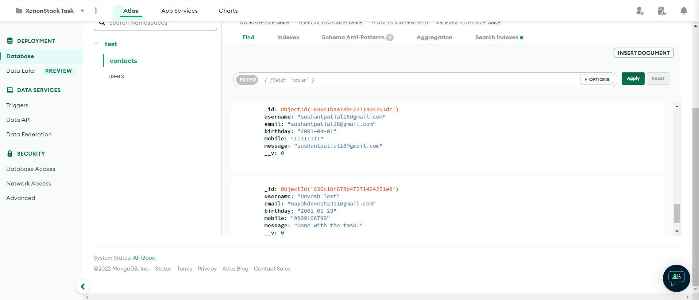
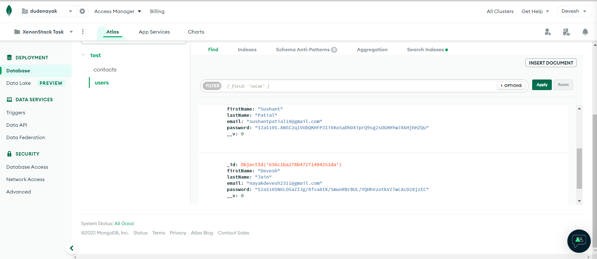

## XenonStack Task - Backend 💻

* A functional website that allows user to login/logout and contact to the company.
* Demonstration of the Web App : 

### Features Accomplished 🤩
* User Login/SignUp
* Logout
* Contact Us
* Carousel

### Technology Decisions 👩🏻‍💻
* **IDE** : Visual Studio Code
* **Platform** : 
	 * Vercel
	 * Heroku
* **Libraries** :
	 * React.JS
	 * Axios
	 * SwiperJS
* **Framework** : Express
* **Runtime Environment** : Node.JS
* **Version Control System :** GitHub
* **Database :** MongoDB
* **Languages** :
	* HTML
	* CSS
	* JavaScript
### Agile Methodology 🏃
Agile is a chain of development in which specific set of tasks are performed iteration wise according to the priority. I divided the web App into smaller chunks and worked on each of them separately. Agile methodology taught me how to work flawlessly and in an organized manner.

### Download Files 👇
* Go to my GitHub repository: https://github.com/dudenayak/XenonStack-Backend
* Download Zip or clone repository
* Then open the folder in your IDE 

### Install the Dependencies ✌️

```shell
# run yarn install or npm install
npm install
```

### Run the App 😻

```shell
# to start the backend, type
npm start
```
Runs the app in the development mode.

Backend is deployed on Heroku : Click [https://xenonstack-backend.herokuapp.com/](https://xenonstack-backend.herokuapp.com/) to view the functioning of server side in the browser 🎉

### Glimpses 📷
 **Database **: Contacts 📂  
 **Database **: Users 🧠  

 

 
